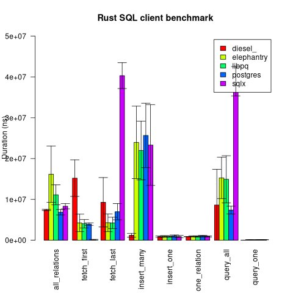

# Rust PostgresSQL clients benchmark

[diesel](https://crates.io/crates/diesel)
· [elephantry](https://crates.io/crates/elephantry)
· [libpq](https://crates.io/crates/libpq)
· [postgres](https://crates.io/crates/postgres)
· [sqlx](https://crates.io/crates/sqlx)

When I started developping *elephantry* I created this benchmark to check my
code performence, maybe there results could interest other people.

## Run

```
psql --command 'create database bench'
DATABASE_URL="postgres://$USER@localhost/bench" ./graph results/graph.png
```

## Results



- fetch first: fetch the first result of a 10 000 rows set;
- fetch last: fetch the last result of a 10 000 rows set;
- insert one: insert a new row;
- insert many: insert 25 rows;
- query all: fetch all results of a 10 000 rows table;
- query one: fetch all results of a 1 row table.
